<div align="center">

# Half CA

**AI GST reconciliation that follows the goods.**<br>
Half a chartered accountant, all of the paperwork.

*The paper says the goods moved. The road says whether they did.*

**[Live demo → halfca.akshatchowdhary.online](https://halfca.akshatchowdhary.online)**

Built at **Fintechstico** by **AliBabaAurKaamChor** · Problem Statement 2: Intelligent Tax Reconciliation

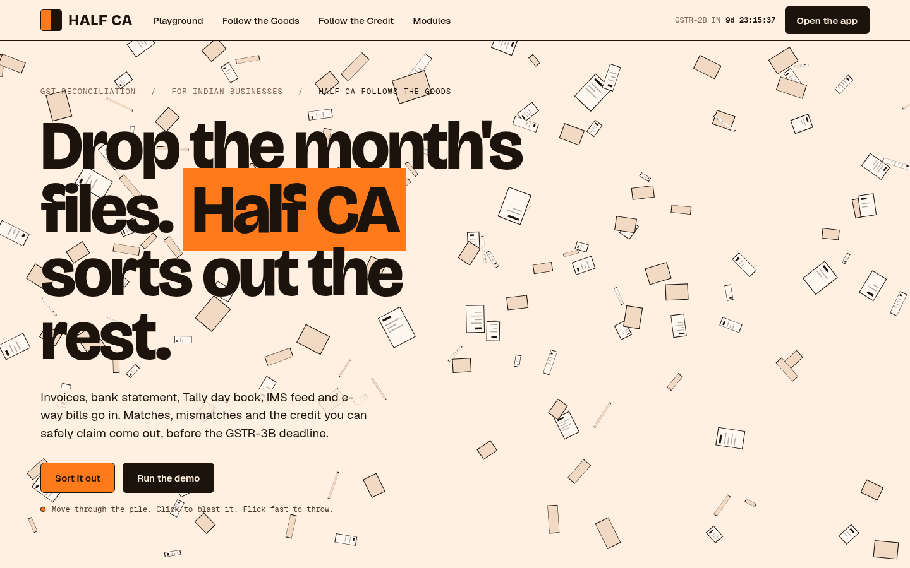

</div>

---

## What it does

Drop a month's files and Half CA reconciles them: the **invoice register**, the **bank statement**, the **Tally day book**, the **GST IMS feed** and the **e-way bills**. Any invoice PDFs in the folder are read too. It does the standard three-way match, then adds two checks that a paper-only tool cannot do:

1. **Follow the Goods.** Invoice → e-way bill → the truck's FASTag toll crossings. A fake invoice can be paid and booked and still pass every paper check. It cannot put a truck on the highway.
2. **Follow the Credit.** The upstream supplier graph. Is your input tax credit built on a ring of shell firms trading in circles?

Every finding comes with its evidence: what was recorded, what was expected, and the chain of records behind it. The AI never produces a number. Every amount, match decision, score and total comes from deterministic code.

> **All data is synthetic.** Every company, GSTIN and person in the demo is fictional. In real life, toll-crossing and upstream supplier data sit with tax authorities and aggregators. Half CA positions these checks for auditors and officers.

## The demo month

Arora Hardware Distributors (Delhi), September 2026:

| | |
|---|---|
| Invoices reconciled | **552**: 489 matched · 38 discrepancies · 7 duplicates · 18 unmatched |
| Failed the road | **5** invoices that pass every paper check: one paper-only supply, one 480 km trip in 3 h (158 km/h), one truck trip billed three times |
| Supplier ring | **5** shell firms trading in a circle, feeding Kaveri Metals (taint score 0.82) |
| IMS Autopilot | **212** supplier invoices: 197 accept · 11 reject · 4 kept pending |
| Net GST payable | **₹6.8 L as filed → ₹12.1 L reconciled** |
| Exposure caught before filing | **₹5.3 lakh** |

Click **Download sample folder** on the Upload screen to get the month's files, then drop the folder back in.

## Screenshots

### Upload: drop a folder, watch it work
Five sources are recognised by name and content. Invoice PDFs are read by AI, and every value is checked against the PDF's own text.

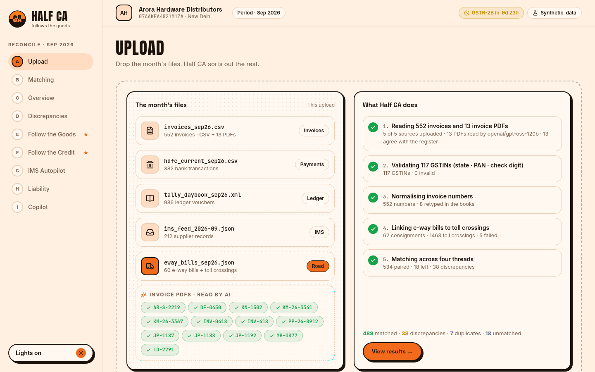

### Overview: the month at a glance
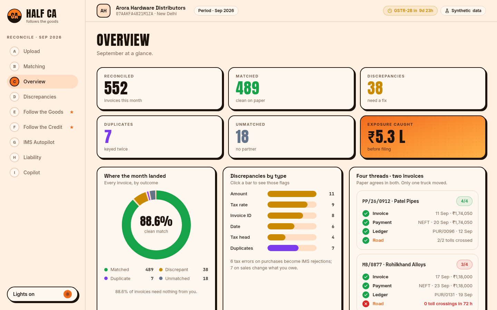

### ★ Follow the Goods: the road check
Each consignment is replayed on a map against the truck's toll crossings. In this frame, KN/1502 has just "driven" 480 km in 3 h 02 m.

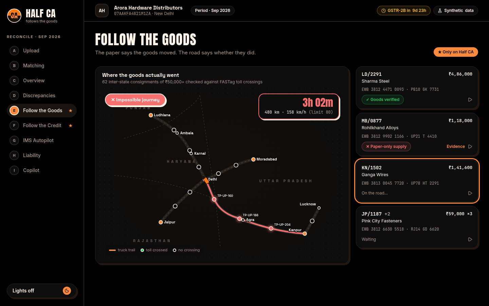

### ★ Follow the Credit: the supplier ring
A 5-firm circular-trading ring sits two hops upstream of Kaveri Metals, putting ₹4.2 lakh of input tax credit at risk.

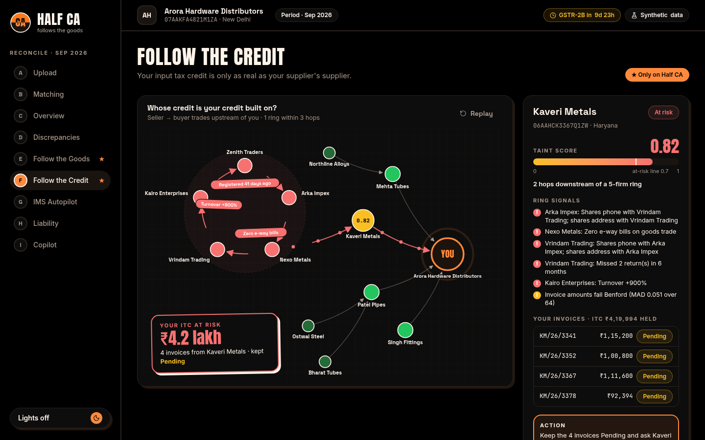

<table>
<tr>
<td width="50%"><b>Matching</b>: cheapest rules first; the AI only sees the hardest cases<br>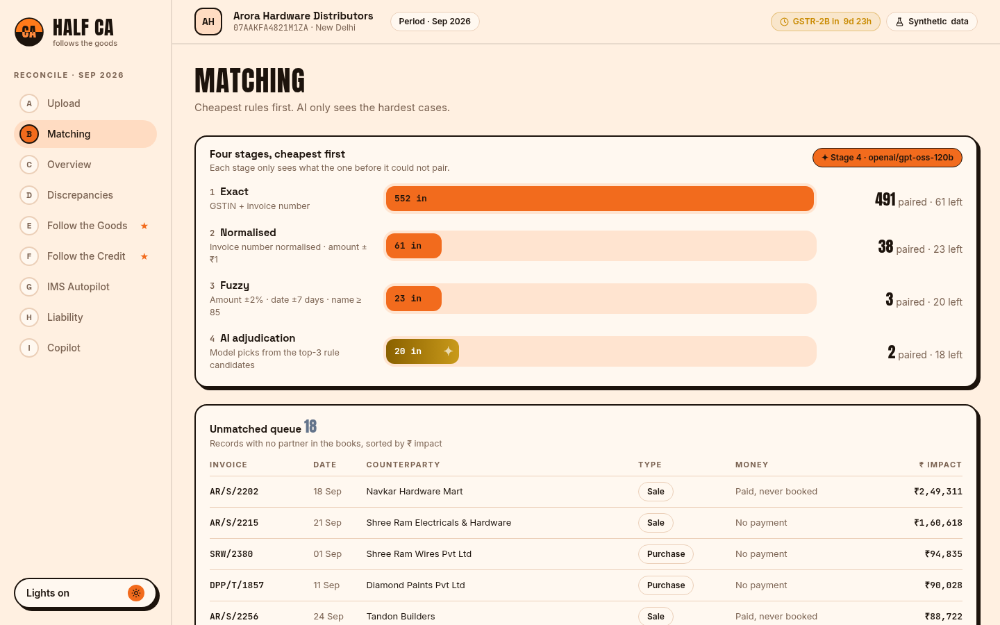</td>
<td width="50%"><b>Discrepancies</b>: abolished tax slabs, wrong tax heads, renumbered duplicates<br>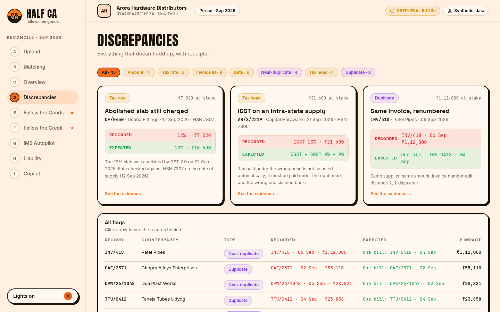</td>
</tr>
<tr>
<td><b>IMS Autopilot</b>: accept, reject or hold every supplier invoice before GSTR-2B<br>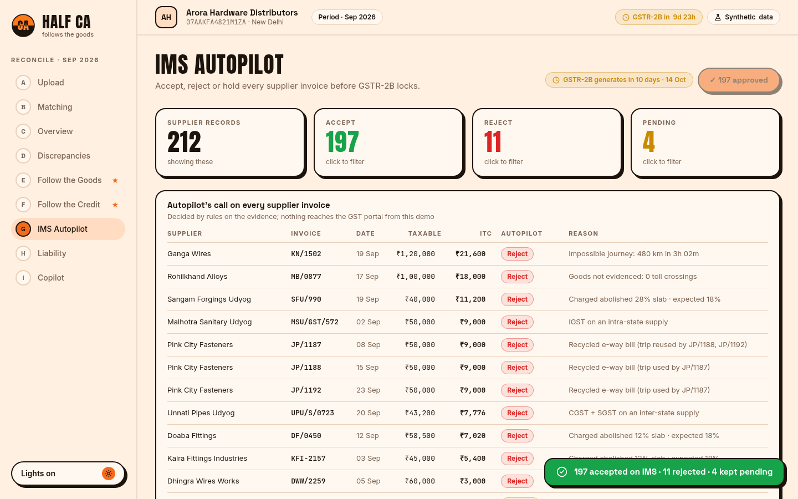</td>
<td><b>Liability</b>: what you actually owe, plus a Benford screen<br>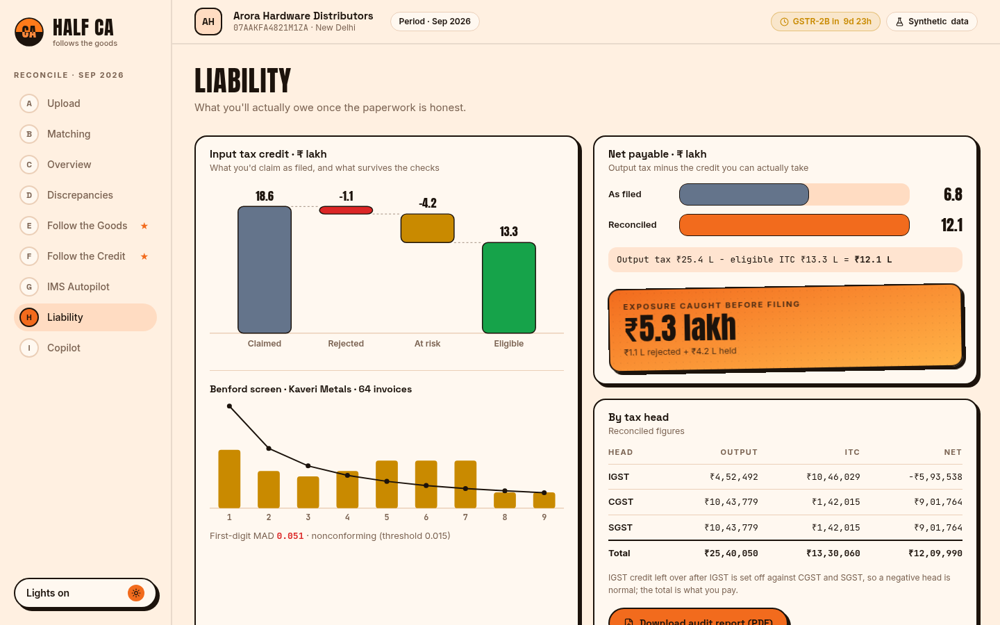</td>
</tr>
</table>

### Copilot: every answer shows its working
It answers by calling the same seven tools as the MCP server. The tool calls appear as they run, and every number in the answer must trace to a tool result.

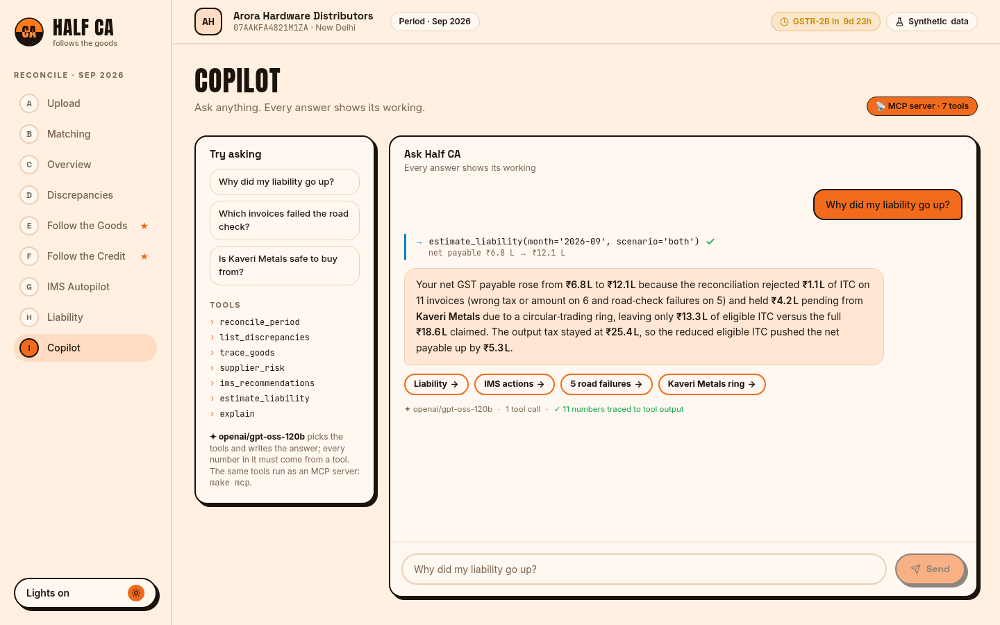

### Audit report (PDF)
A 13-page report you can hand to your CA, with the evidence chain of every finding.

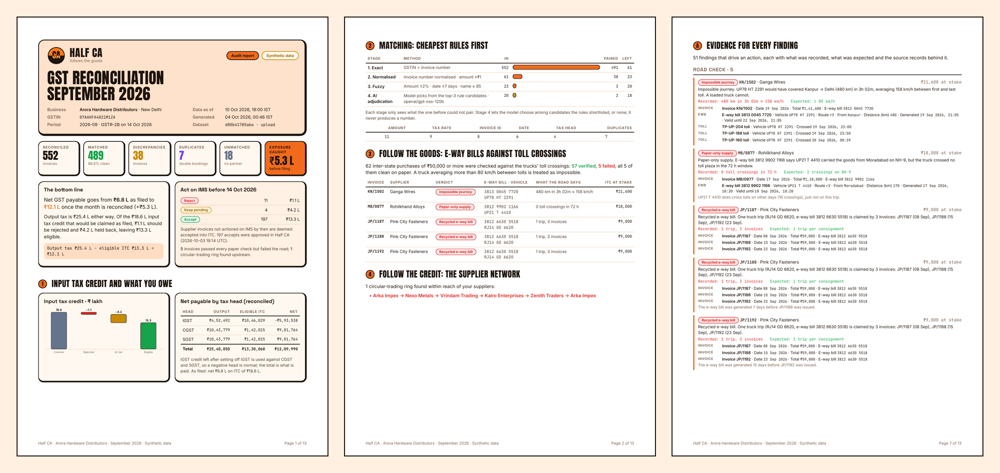

### Works on a phone, in light and pure-black dark mode
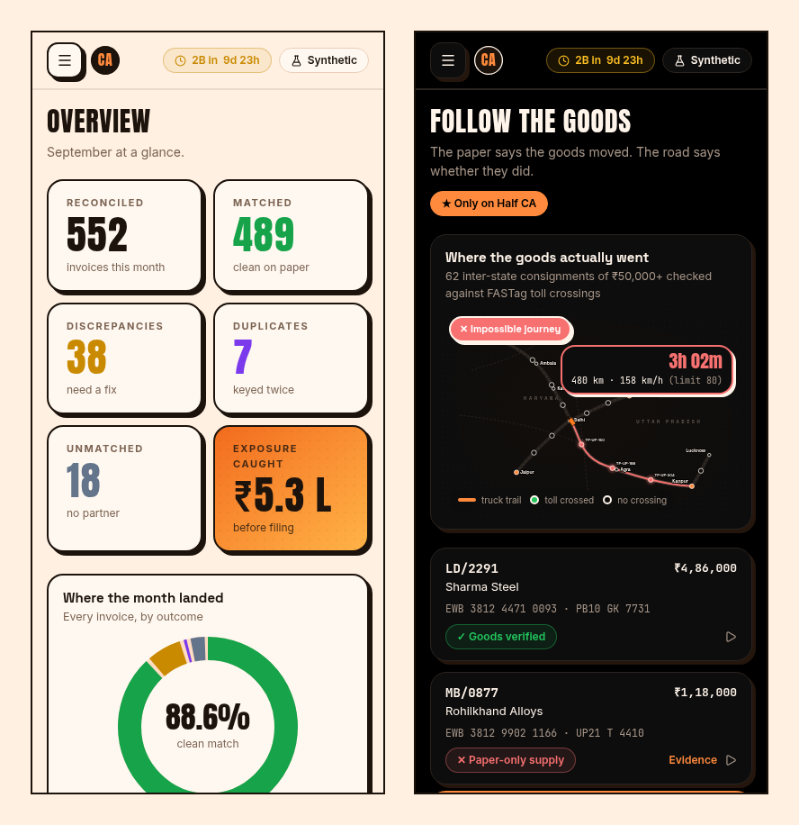

## How it works

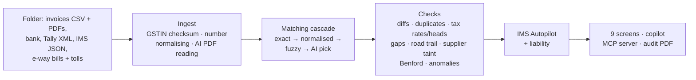

- **Matching cascade:** exact invoice number, then the number normalised (`INV-0418` = `INV/418`), then fuzzy (amount ±2%, date ±7 days, party-name similarity), then an AI pick among the top 3 candidates the rules found, or "none".
- **Tax:** rates are checked against the HSN rate for the date of supply. GST 2.0 slabs are 0/5/18/40% from 22 Sep 2025, so 12% and 28% are abolished. The tax head (IGST vs CGST + SGST) follows supplier state and place of supply.
- **Road trail:** inter-state purchases of ₹50,000 or more need an e-way bill and toll crossings on the declared route within its validity. An average speed above 80 km/h is impossible, and a truck trip claimed by several invoices is recycled.
- **Credit taint:** circular-trading rings in the supplier graph taint the credit that flows through them (×0.9 per hop). Suppliers at 0.7 or above are held Pending.
- **IMS Autopilot:** deterministic rules decide Accept / Reject / Pending, each with a written reason. Unactioned invoices are deemed accepted into your credit, so these calls matter before GSTR-2B.

### Where the AI is used, and where it isn't

| The model does | The model never does |
|---|---|
| Reads invoice PDFs into a fixed schema (each value is then checked against the PDF's text) | Compute a tax amount, total or score |
| Picks among match candidates the rules shortlisted | Decide an IMS action |
| Writes the copilot's answers from tool results | Write a number that isn't in a tool result (a guard checks every number) |

Without an API key, everything still works: stage-4 matching is skipped, and the copilot answers from templates over the same tools.

## Accuracy on synthetic data

`make eval` generates 10 random months (~550 invoices each) with discrepancies planted at known rates and labelled. It reads them back through the same upload loaders and scores what the engines flag, per invoice.

| | Planted | Flagged | Correct | Precision | Recall |
|---|---:|---:|---:|---:|---:|
| All 16 discrepancy types | 887 | 984 | 886 | **90.0%** | **99.9%** |

Every type scores 100% except two:
- **Invoice without payment (55.8% precision):** most of the extra flags are clean invoices that really were unpaid past 30-day terms; the generator didn't label them as planted.
- **Threshold hugging (94.5% precision).**

The per-type table is in [docs/EVAL.md](docs/EVAL.md). These numbers are measured on synthetic data built from the same spec as the engines. Expect lower numbers on real, messier books.

## Run it locally

Prerequisites: Python 3.12 with [uv](https://docs.astral.sh/uv/), Node 20+ with pnpm, and Pango (for the PDF report).

```bash
make setup     # backend (uv) + frontend (pnpm) dependencies
make data      # generate the demo month (seed 2609) into data/
make dev       # API on :8000 + web on :3000
```

Open <http://localhost:3000>, click **Open the app**, then **Download sample folder** and drop it on the Upload screen.

**Optional AI key.** Put this in `backend/.env` (never committed):

```bash
HALFCA_LLM_PROVIDER=groq          # or openai / openrouter / ollama
HALFCA_LLM_API_KEY=your-key
# HALFCA_LLM_MODEL=openai/gpt-oss-120b   (default for groq)
```

| Command | Does |
|---|---|
| `make test` | Backend tests (139) + frontend typecheck and lint |
| `make eval` | Precision / recall per discrepancy type → `docs/EVAL.md` |
| `make report` | Audit PDF → `data/audit-report-2026-09.pdf` |
| `make demo-pack` | The sample folder (5 sources + 13 invoice PDFs) in `./demo-pack` |
| `make mcp` | The MCP server on stdio |

### Use it from Claude (MCP)

The copilot's seven tools also run as an MCP server: `reconcile_period`, `list_discrepancies`, `trace_goods`, `supplier_risk`, `ims_recommendations`, `estimate_liability` and `explain`.

```bash
claude mcp add halfca -- uv --directory /path/to/HalfCA/backend run python -m halfca.mcp_server
```

## Tech stack

| | |
|---|---|
| Backend | Python 3.12, FastAPI, Pydantic v2, DuckDB, pandas, RapidFuzz, NetworkX, scikit-learn, WeasyPrint |
| AI | Any OpenAI-compatible provider (Groq `openai/gpt-oss-120b` in the demo), disk-cached at temperature 0 |
| Frontend | Next.js (static export), TypeScript, Tailwind CSS, Motion, SWR; custom SVG map and graph, no map tiles |
| MCP | Official MCP Python SDK, stdio |
| Deploy | Docker Compose behind Caddy |

## Repo layout

```
backend/halfca/
  data/        synthetic month generator (demo + random mode with truth labels)
  ingest/      CSV/XML/JSON loaders, GSTIN checksum, AI PDF reading
  engines/     matching, tax, duplicates & gaps, road trail, credit taint, anomalies, liability
  ai/          LLM client + cache, stage-4 adjudication, IMS Autopilot, copilot
  tools.py     the 7 tools (copilot + MCP server)
  report/      the audit PDF
  api/         FastAPI routes
frontend/      the 9 screens, the map, the ring graph; public/landing.html is the landing page
docs/          PLAN.md (build order), CONTEXT.md (handoff notes), EVAL.md (accuracy)
```

---

<div align="center">
<sub>All data in this project is synthetic. Fonts in <code>backend/halfca/report/fonts</code> are under the SIL Open Font License.</sub>
</div>
